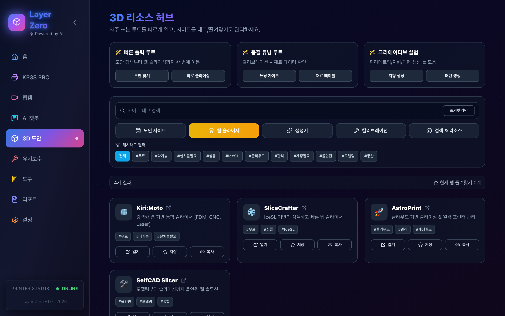
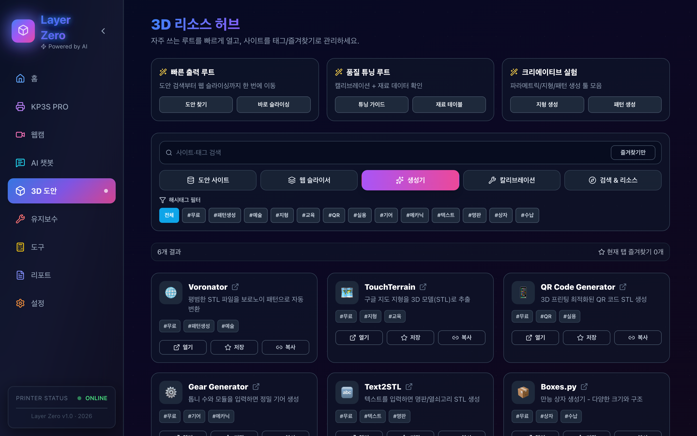
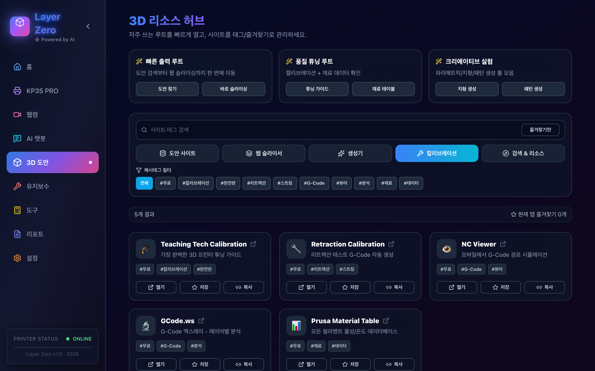
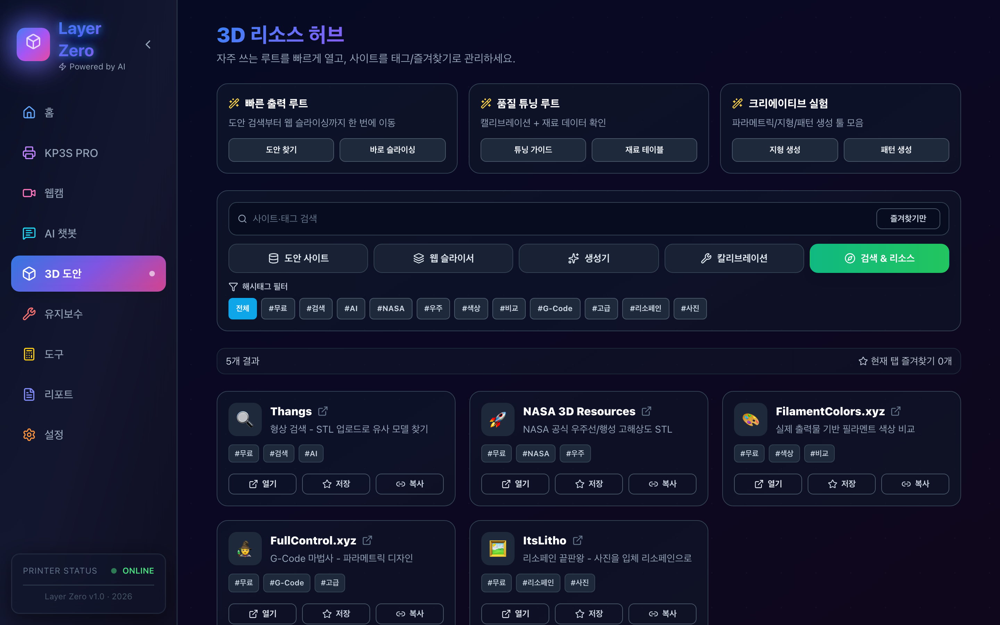

# Layer Zero 프로젝트 가이드


Layer Zero는 3D 프린터 운영에서 필요한 기능을 한 화면 체계로 묶은 통합 웹 콘솔입니다.

## 1. 프로젝트 목표

- 상태 파악 시간을 줄이고 빠르게 판단
- 에러/경고 발생 시 즉시 조치
- 출력 결과를 누적해 품질 개선 루프 형성

## 2. IA(정보 구조)

- **홈**: 대시보드 및 핵심 제어
- **프린터**: Klipper 원본 인터페이스 (Mainsail/Fluidd)
- **웹캠**: 다중 카메라 모니터링 및 보정
- **AI 챗봇**: 운영 보조 및 문제 해결
- **3D 도안**: 도안 검색, 슬라이서, 도구 모음
- **유지보수**: 소모품 관리 및 점검 이력
- **도구**: 캘리브레이션 계산기 및 트러블슈팅
- **리포트**: 출력 이력 및 통계 분석
- **설정**: 시스템 연결 및 환경 설정

## 3. 탭별 상세

### 3.1 홈 (Home)
프린터의 현재 상태를 한눈에 파악하고 가장 빈번하게 사용하는 제어 기능을 제공합니다.

#### Light Mode


#### Dark Mode


**핵심 기능:**
- **상태 모니터링**: 진행률, 남은 시간, 완료 예정 시각, 현재 레이어 등 표시
- **실시간 데이터**: 온도(노즐/베드), 속도, 유량, 팬 속도, Z 높이 시각화
- **비용 견적**: 필라멘트 및 전기 요금을 포함한 실시간 비용 계산
- **자동 레벨링**: 베드 가열 → G28 → 메쉬 측정 → 저장을 원클릭으로 수행
- **긴급 제어**: 비상 정지(M112), 일시 정지, 재개, 매크로 실행
- **콘솔 이력**: 최근 실행된 G-code 및 시스템 응답 확인

### 3.2 프린터 (Printer)
Klipper의 기본 웹 인터페이스(Mainsail 또는 Fluidd)를 내장하여 심층적인 제어를 지원합니다.

#### Light Mode


#### Dark Mode


**핵심 기능:**
- **G-code 파일 관리**: 업로드, 삭제, 출력 시작
- **상세 제어**: Klipper의 모든 네이티브 기능 접근 가능
- **설정 동기화**: `printer.cfg` 등 시스템 설정 파일 직접 수정 가능

### 3.3 웹캠 (Webcam)
출력 상황을 실시간으로 육안 확인하고 이미지 보정을 수행합니다.

#### Light Mode


#### Dark Mode


**핵심 기능:**
- **멀티뷰**: CAM1, CAM2 전환 지원
- **화면 조정**: 회전(0/90/180/270도), 좌우 반전
- **이미지 필터**: 업스케일링, 노이즈 제거, 대비/밝기/채도 조절
- **캡처**: 현재 화면 스냅샷 저장 및 전체화면 보기

### 3.4 AI 챗봇 (AI Chatbot)
llm을 활용하여 3D 프린팅 관련 질문에 답변하고 문제를 진단합니다.

#### Light Mode


#### Dark Mode


**핵심 기능:**
- **모델 선택**: Free/Paid 모델 (Flash/Pro) 전환
- **대화 관리**: 질문/답변 이력 저장 및 동기화
- **유틸리티**: 답변 복사, 요약, 재생성 기능

### 3.5 3D 도안 (3D Models)
도안 검색부터 슬라이싱, 캘리브레이션까지 출력 준비 과정을 지원하는 리소스 허브입니다.

#### 도안 사이트 (Models)
STL 파일 검색 및 다운로드를 위한 주요 사이트 바로가기 및 태그 필터링을 제공합니다.


#### 웹 슬라이서 (Slicers)
설치 없이 브라우저에서 바로 슬라이싱 가능한 도구들을 모았습니다.



#### 생성기 (Generators)
상자, 기어, 리소페인 등 파라메트릭 모델을 생성하는 도구입니다.



#### 칼리브레이션 (Calibration)
프린터 튜닝 및 테스트를 위한 가이드와 도구 모음입니다.



#### 검색 & 리소스 (Resources)
기타 유용한 3D 프린팅 관련 검색 엔진 및 자료실입니다.



### 3.6 유지보수 (Maintenance)
프린터의 컨디션을 최상으로 유지하기 위한 주기적인 관리 도구입니다.

#### Light Mode


#### Dark Mode


**핵심 기능:**
- **건강 점수**: 노즐, 윤활, 필라멘트 상태를 기반으로 한 종합 점수
- **소모품 추적**: 노즐 교체 주기, 윤활 주기, 남은 필라멘트 잔량 관리
- **로그 및 체크리스트**: 정비 이력 기록 및 주기적 점검표 관리
- **베드 메쉬 이력**: 과거 레벨링 데이터 저장 및 3D 평탄도 그래프 시각화

### 3.7 도구 (Tools)
계산기와 문제 해결 가이드를 제공하여 최적의 출력 값을 찾도록 돕습니다.

#### Light Mode


#### Dark Mode


**핵심 기능:**
- **계산기**: E-Step, Flow Rate, PID 튜닝, 리트랙션 값 계산
- **모션 프로파일**: 가속도/속도에 따른 출력 시간 및 품질 예측 그래프
- **트러블슈팅**: 출력 실패 증상별 원인 및 해결책 가이드

### 3.8 리포트 (Reports)
완료된 출력물의 상세 정보를 기록하고 분석합니다.

#### Light Mode


#### Dark Mode


**핵심 기능:**
- **출력 이력**: 성공/실패 여부, 소요 시간, 비용 등 기록
- **품질 분석**: 타임라인 기반 품질 변화 및 경고/에러 발생 시점 추적
- **데이터 시각화**: 온도, 비용, 품질 점수 변화 그래프

### 3.9 설정 (Settings)
Layer Zero의 모든 환경 설정을 관리합니다.

#### Light Mode


#### Dark Mode


**핵심 기능:**
- **연결 설정**: 프린터 IP, 웹캠 주소, 날씨 위치 설정
- **성능 옵션**: 대시보드 폴링 주기, 차트 갱신 주기 조정
- **비용 설정**: 필라멘트 단가 및 전기 요금 단가 입력
- **알림 및 권한**: 브라우저 알림 권한 요청 및 에러 알림 설정
- **데이터 관리**: 설정 내보내기/가져오기, 초기화

## 4. 데이터 구조 및 동기화

- **중앙 저장소**: `server/data/store.json`에 모든 설정 및 이력 저장
- **실시간 동기화**: SSE(Server-Sent Events)를 통해 다중 클라이언트 간 상태 동기화
- **오프라인 지원**: 서버 연결 실패 시 LocalStorage에 임시 저장 후 재연결 시 동기화

## 5. 설치 및 실행

```bash
# 의존성 설치
npm install

# 환경 변수 설정
cp .env.example .env.local

# 개발 서버 실행 (Web: 5173, API: 8787)
npm run dev
```

## 6. 보안 및 운영

- **API 키 관리**: `.env.local`을 통해 관리하며 Git에 커밋하지 않음
- **알림 권한**: 브라우저 정책상 HTTPS 또는 localhost 환경에서만 동작
- **백업**: 주기적으로 설정 파일 내보내기 권장

