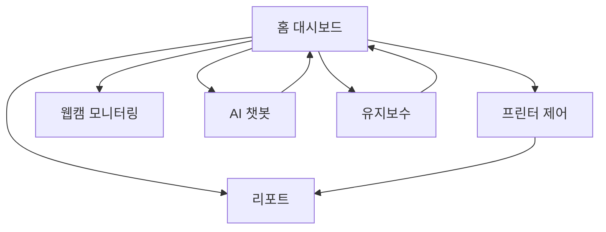
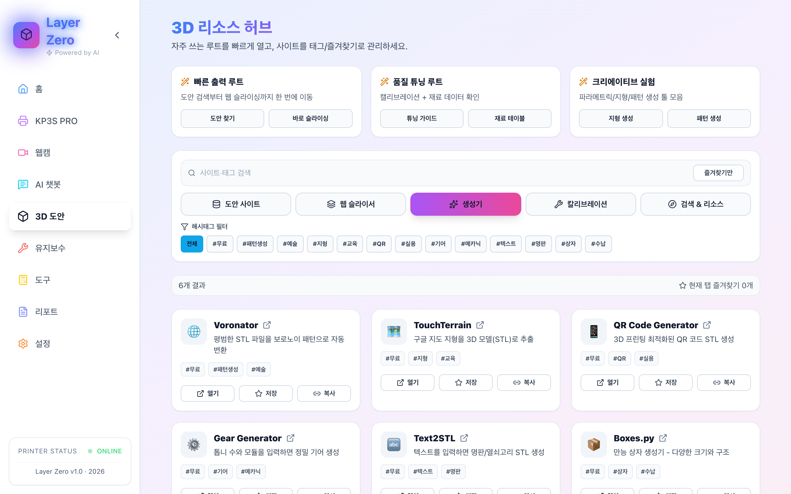
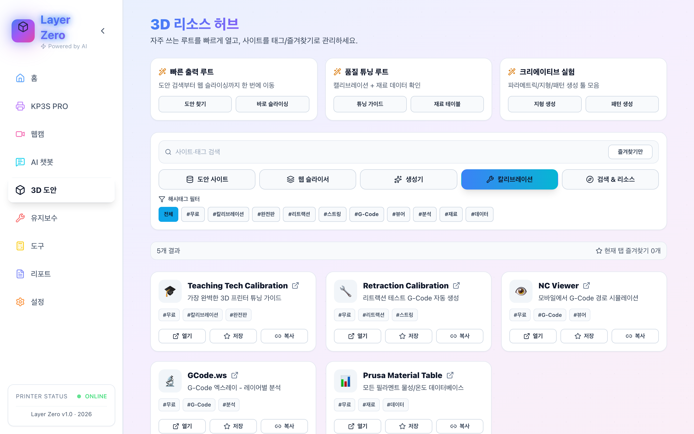
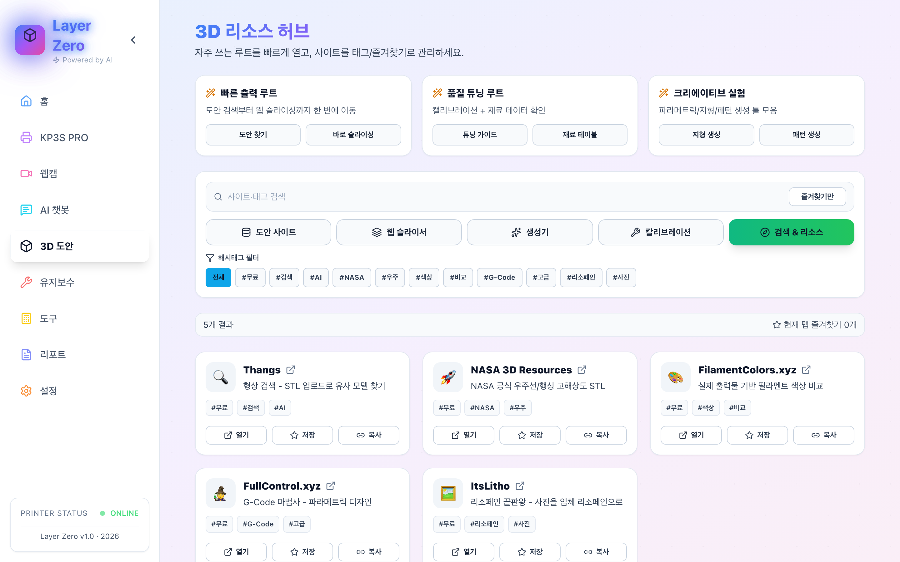
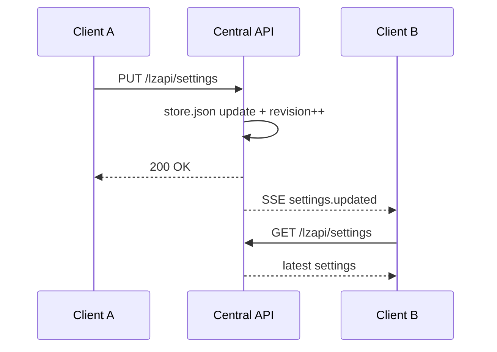

# Layer Zero 프로젝트 상세 가이드


본 문서는 Layer Zero의 기능, 데이터 흐름, 운영 절차를 팀 인수인계 수준으로 정리한 기술 가이드입니다.

---

## 목차
- [1. 제품 철학과 설계 방향](#1-제품-철학과-설계-방향)
- [2. 화면 구조와 사용자 흐름](#2-화면-구조와-사용자-흐름)
- [3. 탭별 상세 기능 명세](#3-탭별-상세-기능-명세)
- [4. 데이터 저장/동기화 구조](#4-데이터-저장동기화-구조)
- [5. 네트워크 및 프록시 동작](#5-네트워크-및-프록시-동작)
- [6. 설치/실행/배포](#6-설치실행배포)
- [7. 운영 안정화 가이드](#7-운영-안정화-가이드)
- [8. 장애 대응 매뉴얼](#8-장애-대응-매뉴얼)
- [9. 보안 운영 원칙](#9-보안-운영-원칙)
- [10. 향후 확장 포인트](#10-향후-확장-포인트)

---

## 1. 제품 철학과 설계 방향

### 1.1 Design-Driven
Layer Zero는 단순히 버튼을 모아둔 제어 패널이 아니라, “운영 중 의사결정” 자체를 빠르게 만들기 위한 UI를 목표로 합니다.

핵심 원칙:
- 정보 계층화: 지금 당장 중요한 정보가 가장 먼저 보이도록 구성
- 제어 최소 이동: 자주 쓰는 액션은 홈에서 바로 실행
- 피드백 명확화: 버튼 클릭 이후 진행 단계/결과를 즉시 보여줌

### 1.2 Mobile-First
현장에서 스마트폰으로 모니터링/제어하는 시나리오를 기본값으로 가정합니다.

핵심 원칙:
- 터치 우선 인터랙션
- 작은 화면에서도 핵심 상태 손실 없이 표시
- iOS Safari 특성(백그라운드/복귀) 고려

### 1.3 All-in-One
다음 흐름이 한 앱 안에서 끊김 없이 이어집니다.
- 출력 준비(도안/슬라이서/캘리브레이션)
- 출력 중 모니터링 및 제어
- 출력 완료 후 리포트/유지보수 누적

---

## 2. 화면 구조와 사용자 흐름



운영 흐름 예시:
1. 홈에서 상태/경고 확인
2. 이상 발견 시 콘솔/빠른 버튼/웹캠으로 즉시 대응
3. 필요한 경우 AI 챗봇으로 원인 추론
4. 출력 완료 후 리포트 자동 기록 확인
5. 유지보수 탭에서 소모품/이력 업데이트

---

## 3. 탭별 상세 기능 명세

## 3.1 홈 (Home)


### 목적
운영자가 출력 중 상태를 가장 빠르게 파악하고, 핵심 제어를 즉시 실행하게 하는 메인 탭

### 핵심 위젯
- 시스템 시간 카드
- 프린터 상태 카드
- 원형 진행률 표시
- 남은 시간/완료 예정/현재 높이/속도/유량/팬
- 경고 카드(조건 충족 시만 노출)
- 실시간 비용 견적
- 외부 환경(날씨/AQI)

### 핵심 액션
- 비상정지 / 일시정지 / 재개 / 취소
- 수동 콘솔 명령
- 빠른 G-code 실행
- 자동 레벨링

### 자동 레벨링 절차
현재 구현된 워크플로우는 아래 순서로 실행됩니다.
1. 베드 히팅(목표 온도)
2. 홈 이동(G28)
3. 베드 메쉬 측정(BED_MESH_CALIBRATE)
4. 설정 저장(SAVE_CONFIG)
5. 결과 팝업 + 메쉬 데이터 저장

### 운영 포인트
- 레벨링 진행 상태(현재 단계/총 단계)를 사용자에게 명시
- 실패 시 즉시 에러 메시지 출력
- 성공 시 기록을 유지보수 탭 이력에 반영

---

## 3.2 프린터 (Printer)


### 목적
Klipper 원본 인터페이스를 앱 맥락 안에 포함해 고급 제어를 끊김 없이 수행

### 특징
- 기본 주소가 Moonraker(`:7125`)로 들어와도 프린터 뷰는 UI 포트(`:8888`)로 보정
- 새로고침 시 캐시 방지를 위해 timestamp 파라미터 부여

### 운영 포인트
- 프린터 UI 자체 문제인지 Layer Zero 문제인지 분리 진단 가능
- 파일 업로드/매크로 실행/설정 변경은 원본 UI 기준으로 신뢰성 확보

---

## 3.3 웹캠 (Webcam)


### 목적
출력 품질/실패 징후를 시각적으로 빠르게 확인

### 주요 기능
- 웹캠 1/2 전환
- 회전(0/90/180/270)
- 좌우 반전
- 이미지 보정(밝기/대비/채도/업스케일)
- 스냅샷

### 운영 포인트
- ESP32-CAM 저해상도 환경에서 보정 옵션 체감 큼
- 모바일/PC에서 동일하게 조작 가능하도록 UI 간소화

---

## 3.4 AI 챗봇


### 목적
출력 실패/품질 문제에서 “원인 추론 + 액션 제안” 시간을 줄이는 보조 인터페이스

### 주요 기능
- Free/Paid 모드 전환
- Paid 모델 선택(Flash/Pro)
- 대화 이력 유지
- 최근 답변 복사/요약/재생성
- 모바일 폰트 크기 제어

### 저장 구조
- `chat.messages`를 중앙 저장소에 보관
- 서버 연결 실패 시 로컬 폴백
- SSE로 다중 클라이언트 동기화

### 운영 포인트
- API 키는 환경 변수/설정 관리 체계를 분리해 운영
- 공개 저장소 배포 전 키 제거 필수

---

## 3.5 3D 도안






### 목적
출력 준비 단계에서 필요한 외부 자원을 한 번에 접근

### 구성
- 도안 사이트
- 웹 슬라이서
- 생성기
- 캘리브레이션 리소스
- 검색/참고 리소스

### 운영 포인트
- 사용자 북마크/즐겨찾기 기반으로 반복 작업 가속
- 출력 준비 시간을 체감적으로 단축

---

## 3.6 유지보수 (Maintenance)


### 목적
출력 성공률을 높이기 위한 예방 정비 데이터 관리

### 주요 기능
- 소모품 상태
- 유지보수 로그
- 점검 체크리스트
- 베드 메쉬 이력
- 3D 메쉬 시각화

### 베드 메쉬 기록 항목
- 시간
- 행/열 크기
- min/max/avg
- 메쉬 행렬(matrix)

### 운영 포인트
- 메쉬 이력의 시간 흐름을 보면 베드 상태 변화 추적 가능
- 특정 실패 시점과 과거 메쉬 상태 상관관계 확인 가능

---

## 3.7 도구 (Tools)


### 목적
수치 기반 캘리브레이션과 빠른 계산을 통한 튜닝 시간 단축

### 제공 도구
- E-Step 계산기
- Flow 계산기
- PID 관련 보조
- 모션 관련 계산

### 운영 포인트
- 계산 결과를 바로 G-code로 복사해 적용 가능
- 반복 실험 과정의 시행착오 감소

---

## 3.8 리포트 (Reports)


### 목적
완료된 출력물을 기록하고 품질/비용/경고를 복기

### 주요 기능
- 출력 완료 자동 리포트 저장
- 품질 점수 및 하락 구간 표시
- 비용 항목 추적
- 상세 페이지 제공

### 운영 포인트
- 성공/실패 케이스를 데이터로 남겨 재현성과 학습 효과 확보

---

## 3.9 설정 (Settings)


### 목적
장비/네트워크/비용/동기화 정책을 중앙 관리

### 주요 기능
- Klipper 주소
- 웹캠 주소 1/2
- 날씨 위치(도시/위경도)
- 비용 기준(재료비/전기요금)
- 알림 권한
- 동기화 관련 설정

### 운영 포인트
- 다중 기기 환경에서 “기준값” 역할
- 잘못된 주소/단가 입력 시 홈 화면 계산 전체에 영향

---

## 4. 데이터 저장/동기화 구조

## 4.1 저장소 구조
- 파일: `server/data/store.json`
- 서버: `server/index.js`
- API prefix: `/lzapi`
- 이벤트 스트림: `/lzapi/events`

## 4.2 저장 리소스
- `settings`
- `meshHistory`
- `reports`
- `maintenance.state`
- `maintenance.logs`
- `maintenance.checklist`
- `chat.messages`

## 4.3 동기화 방식
- 저장 시 리비전 증가
- 변경 리소스 이벤트를 SSE로 전송
- 클라이언트는 이벤트 수신 후 필요 데이터 재동기화



## 4.4 폴백 정책
- 중앙 API 장애 시 로컬 저장 사용
- 연결 복구 시 중앙 데이터 우선

---

## 5. 네트워크 및 프록시 동작

## 5.1 개발 환경
Vite에서 아래 프록시를 사용합니다.
- `/api` → Moonraker
- `/lzapi` → Central API

`vite.config.js`에서 `ws: true`가 설정되어 있어 WebSocket 경로도 안정적으로 프록시됩니다.

## 5.2 권장 주소 체계
- Moonraker: `http://<printer-ip>:7125`
- 프린터 웹 UI: `http://<printer-ip>:8888`
- Layer Zero UI: `http://<host-ip>:5173`
- Central API: `http://<host-ip>:8787`

---

## 6. 설치/실행/배포

## 6.1 로컬 설치
```bash
git clone https://github.com/habinsong/Layer-Zero.git
cd Layer-Zero
npm install
cp .env.example .env.local
npm run dev
```

## 6.2 운영 실행(PM2)
```bash
pm2 start ecosystem.config.cjs
pm2 save
pm2 startup
```

## 6.3 스크립트 기반 실행
```bash
./start-server.sh
```

---

## 7. 운영 안정화 가이드

## 7.1 로그 관리
- `pm2 logs web-print`로 실시간 확인
- 장기간 운영 시 PM2 로그 로테이션 권장

## 7.2 리소스 관리
- 브라우저 메모리 사용량이 높은 탭(웹캠/3D 그래프/챗봇) 동시 사용 시 주의
- 모바일 Safari는 백그라운드 복귀 시 세션 재연결 지연 가능

## 7.3 백업
정기 백업 대상:
- `server/data/store.json`
- `.env.local`

---

## 8. 장애 대응 매뉴얼

## 8.1 OFFLINE 문제
1. Moonraker 접속 확인
2. 포트 확인(7125)
3. 설정 주소 검증
4. CORS/trusted_clients 확인
5. Network 탭에서 `/api/*` 응답 확인

## 8.2 파일 업로드 실패
- Moonraker `max_upload_size` 확인
- 저장 경로 권한 확인
- 디스크 용량 확인

## 8.3 동기화 지연
- `/lzapi/health` 체크
- SSE 연결 유지 여부 확인
- 클라이언트 새로고침 후 재확인

## 8.4 알림 미동작
- HTTPS/localhost 정책 확인
- 브라우저 권한 확인
- iOS 제한사항 확인

---

## 9. 보안 운영 원칙
- `.env.local` 절대 커밋 금지
- API 키는 사용자 환경별 개별 주입
- 공개 배포 전 키 전량 교체
- 중앙 저장소 접근 제어 필수
- 외부 공개 시 VPN 또는 Reverse Proxy + HTTPS 구성 권장

---

## 10. 향후 확장 포인트
- 중앙 저장소를 SQLite/PostgreSQL로 전환
- 사용자/장비 단위 권한 모델 도입
- 리포트 Export(PDF/CSV)
- 고급 알림 채널(메일/메신저/Web Push)
- 다중 프린터 큐 운영(스케줄링)

