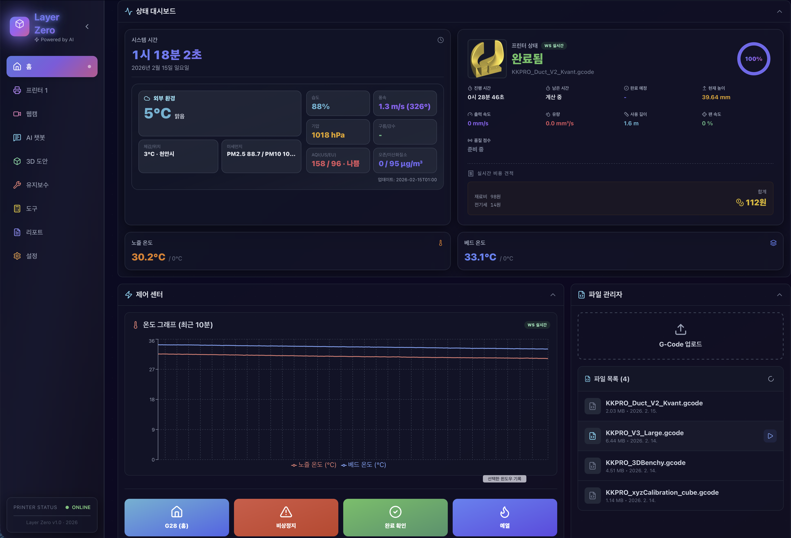
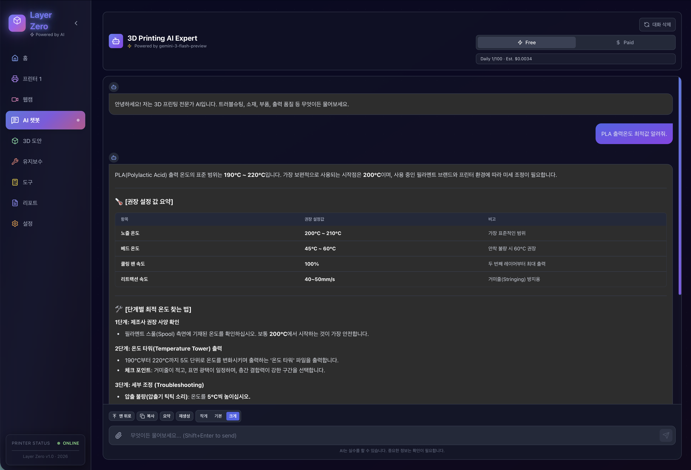
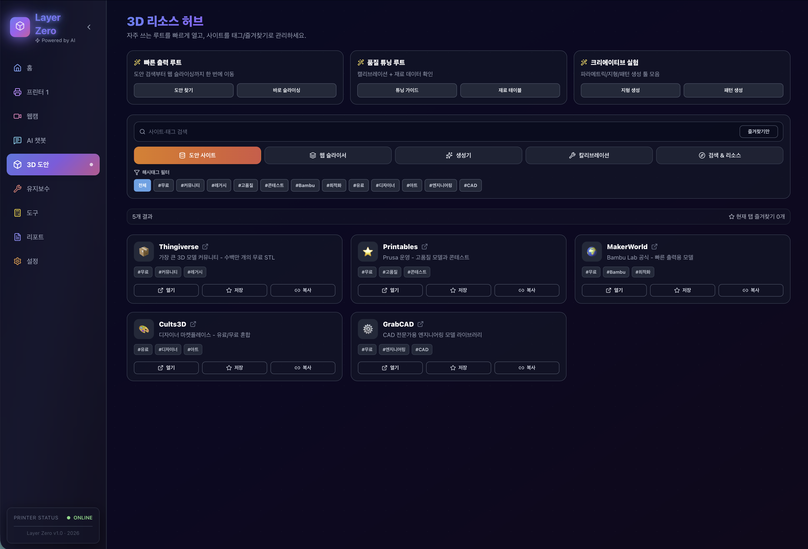
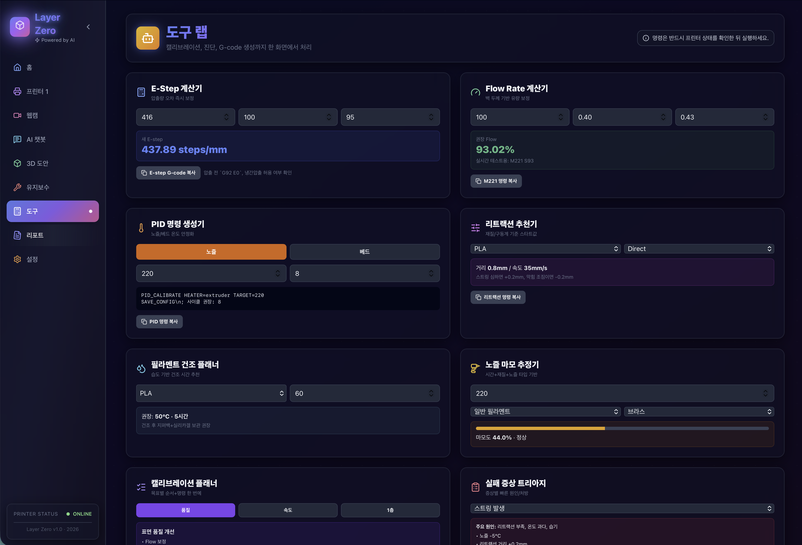
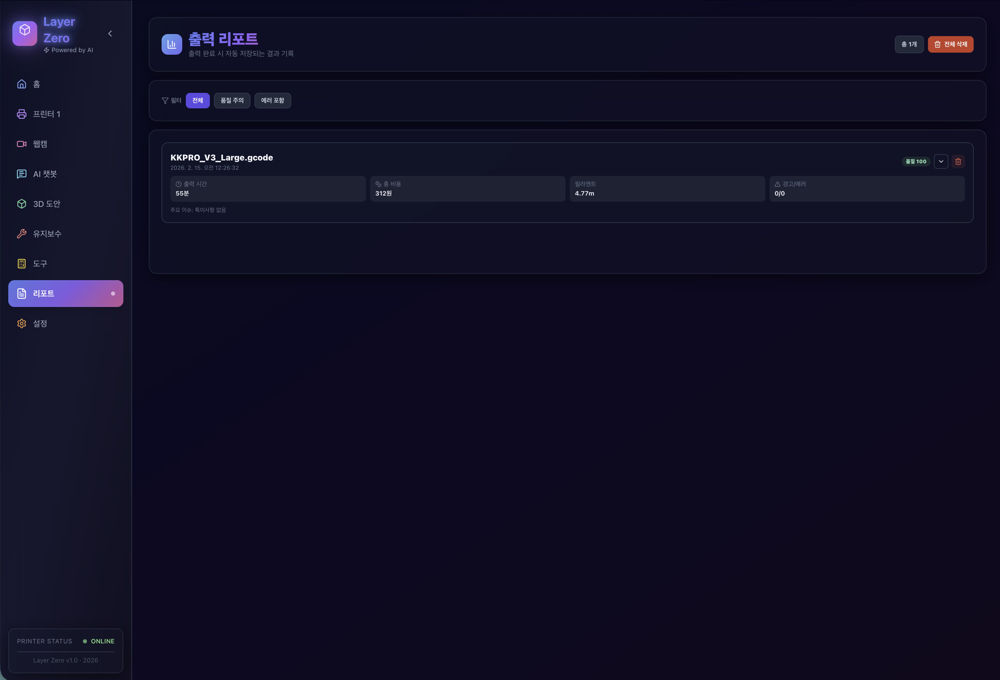
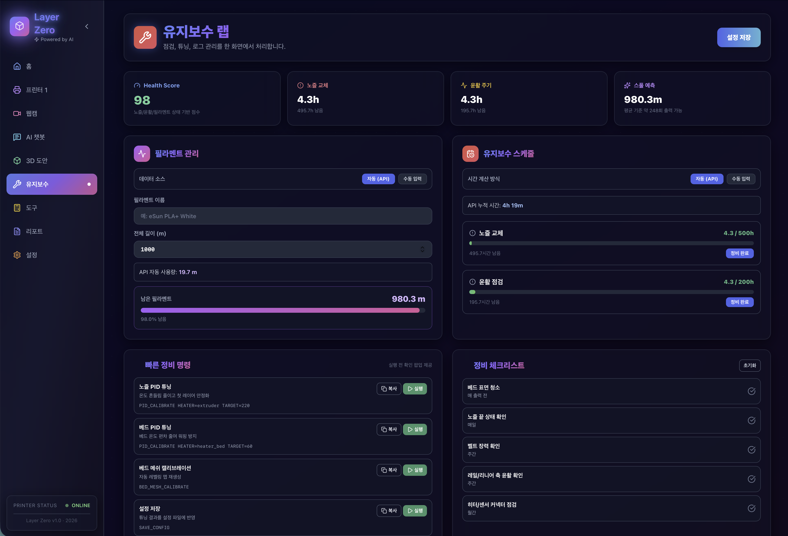
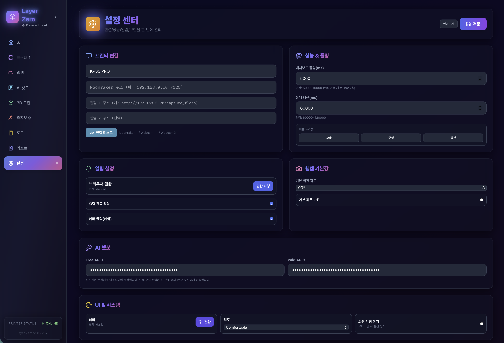

# Layer Zero 프로젝트 가이드


.png>)

> Layer Zero의 제품 철학, UI 설계 원칙, 실시간 아키텍처, 운영 전략을 정리한 공식 가이드

---

## 1. 프로젝트 정의

Layer Zero는 Klipper + Moonraker 기반 3D 프린터를 **웹에서 안정적으로 운영**하기 위한 대시보드입니다.  
목표는 단순한 상태 표시가 아니라, "문제를 빨리 발견하고, 바로 조치하고, 결과를 축적"하는 운영 루프를 만드는 것입니다.

### 1.1 제품 포지션
- 대시보드 + 제어 패널 + 리포트 시스템 + AI 도우미를 하나로 통합
- 모바일/PC 모두에서 동일한 작업 품질 제공
- 실시간성(WS)과 안정성(HTTP fallback)을 동시에 확보

### 1.2 핵심 철학
- **Design-Driven**: 정보 밀도는 높게, 판단 비용은 낮게
- **Mobile-First**: 작은 화면에서도 조작 실수를 줄이는 배치
- **All-in-One**: 작업 맥락 전환 최소화

---

## 2. 사용자 여정 (End-to-End)

### 2.1 출력 준비
1. 홈에서 프린터 상태/온도 확인
2. 파일 관리자에서 G-code 업로드
3. 제어 센터에서 홈(`G28`) 및 예열
4. 출력 시작

### 2.2 출력 진행
1. 실시간 진행률/ETA/속도/유량 확인
2. 웹캠으로 출력면 상태 모니터링
3. 이상 징후 발생 시 에러 원인 카드 확인
4. 원클릭 조치 또는 콘솔 명령 실행

### 2.3 출력 완료
1. 자동 생성 리포트 확인
2. 품질 점수 저하 구간/경고 타임라인 분석
3. 비용/소요시간 비교
4. 다음 출력 프로파일 보정

---

## 3. IA (정보 구조)와 화면 설계

## 3.1 홈 대시보드
**의도**: 지금 상태를 3초 안에 판단

- 상태 헤더: 프린터 상태, 파일명, 진행률, 완료 예상
- 핵심 지표: 출력 시간/남은 시간/속도/유량/Z 높이/팬
- 상황 대응: 경고/에러 카드 + 즉시 조치 버튼
- 환경 데이터: 외부 날씨/공기질 카드
- 품질 인사이트: 실시간 품질 점수 + 상태 라벨

## 3.2 제어 센터
**의도**: 자주 쓰는 제어를 1~2탭으로 실행

- `G28`, 비상정지, 일시정지/재개, 취소
- 예열 프리셋
- Z-Offset 조정
- 매크로 실행
- 콘솔 명령 프리셋 + 수동 입력

## 3.3 파일 관리자
**의도**: 업로드부터 출력 시작까지 대기 시간 최소화

- 파일 목록/메타데이터/썸네일
- 업로드, 출력, 삭제
- 파일 이벤트 기반 자동 갱신

## 3.4 웹캠
**의도**: 저사양 ESP32-CAM에서도 실사용 가능

- CAM1/CAM2 전환
- 회전(0/90/180/270), 좌우반전
- 보정(업스케일/노이즈/대비/밝기/채도)

## 3.5 AI 챗봇
**의도**: 출력 중 판단을 텍스트 인터페이스로 보조

- Free/Paid 모드
- Paid 모델: `gemini-3-flash-preview`, `gemini-3-pro-preview`
- 복사/요약/재생성
- 모바일 가독성 중심 레이아웃

## 3.6 리포트
**의도**: 결과를 데이터로 남겨 반복 품질 개선

- 출력 완료 시 자동 저장
- 품질/경고/비용/시간 요약
- 상세 페이지에서 원인 분석 흐름 제공

## 3.7 유지보수/도구
**의도**: 반복되는 보정/점검 작업 표준화

- E-step/Flow/PID/리트랙션 계산
- 정비 체크리스트 및 주기 관리
- 실패 증상 트리아지

---

## 4. 실시간 시스템 아키텍처

### 4.1 통신 모델
- 기본: **WebSocket 우선 + HTTP 폴백**
- WS 정상: 이벤트 즉시 반영
- WS 단절: 백오프 재연결 + 폴백 폴링

### 4.2 복구 전략
- heartbeat + watchdog
- visibility/pageshow 복귀 처리
- iOS Safari 복귀 시 강제 재동기화 루틴

### 4.3 데이터 정합성 전략
- 이벤트 기반 갱신 + 저주기 보정 폴링
- 파일 관리자: `notify_filelist_changed`, `notify_metadata_update`
- 탭 가시성 기반 불필요 요청 억제

---

## 5. 설정 체계

### 5.1 연결 설정
- 프린터(Moonraker)
- 웹캠 1/2
- 연결 테스트
- 프로필 저장/적용

### 5.2 성능 설정
- 폴링 주기
- 고속/균형/절전 프리셋
- 알림/화면 깨움 옵션

### 5.3 날씨 위치 설정
- 도시명, 위도, 경도 입력
- 기본값: **서울시 (37.5665, 126.9780)**
- 저장 즉시 홈 날씨 카드 반영

### 5.4 AI 키 설정
- Free/Paid 키 분리
- 로컬 저장소 기반 암호화 저장

---

## 6. 설치/실행

### 6.1 요구 사항
- Node.js 18+
- npm
- Klipper + Moonraker 환경

### 6.2 설치
```bash
npm install
```

### 6.3 환경 파일
```bash
cp .env.example .env.local
```

### 6.4 `.env.local` 예시
```env
VITE_DEFAULT_PRINTER_NAME=My Printer
VITE_DEFAULT_KLIPPER_IP=http://<moonraker-ip>:7125
VITE_DEFAULT_WEBCAM_URL=http://<cam1-ip>/capture_flash
VITE_DEFAULT_WEBCAM_URL2=http://<cam2-ip>/capture_flash
VITE_DEFAULT_WEATHER_CITY=서울시
VITE_DEFAULT_WEATHER_LAT=37.5665
VITE_DEFAULT_WEATHER_LON=126.9780
VITE_MOONRAKER_FALLBACK_IP=<moonraker-ip>
VITE_DEV_PROXY_TARGET=http://<moonraker-ip>:7125

VITE_DEFAULT_AI_FREE_API_KEY=...
VITE_DEFAULT_AI_PAID_API_KEY=...
```

### 6.5 실행
```bash
npm run dev
```

### 6.6 빌드
```bash
npm run build
npm run preview
```

### 6.7 PM2
```bash
./start-server.sh
# 또는
pm2 start ecosystem.config.cjs
```

---

## 7. 운영 정책

### 7.1 필수 원칙
1. 개발 모드 프록시(`VITE_DEV_PROXY_TARGET`)를 명시한다.
2. 운영 빌드는 Vite dev proxy에 의존하지 않는다.
3. 민감값은 `.env.local`에서만 관리한다.

### 7.2 다중 접속 권장값
- 대시보드 fallback 폴링: `5000~10000ms`
- 통계 갱신: `60000~120000ms`
- 웹캠은 필요한 기기에서만 활성화

---

## 8. 트러블슈팅

### 8.1 OFFLINE / 500 에러
- Moonraker 주소와 포트(`7125`) 확인
- CORS/trusted_clients 확인
- 동일 네트워크 여부 확인

### 8.2 iOS Safari 복귀 후 정지
- 2~5초 재동기화 대기
- 필요 시 탭 재진입/새로고침
- 임시로 고속 폴링 프리셋 적용 후 복구 확인

### 8.3 웹캠 보정 체감이 낮음
- 보정 값(대비/채도/샤프닝) 상승
- 조명 개선
- ESP32-CAM 원본 한계(320x240) 고려

---

## 9. 보안/데이터

- API 키는 로컬 암호화 저장
- 설정 내보내기에서 민감값 제외
- 공개 저장소에 `.env`, `.env.local` 커밋 금지

---

## 10. UI 갤러리

### 홈 대시보드 (다크/라이트)
실시간 상태 인지와 즉시 대응을 위해 설계된 메인 화면입니다.


.png>)

### AI 챗봇
출력 중 문제 분석, 설정 가이드, 요약을 빠르게 지원하는 화면입니다.



### 3D 도안/리소스
도안 탐색, 도구 링크, 검색 동선을 묶어둔 리소스 허브입니다.



### 도구
캘리브레이션과 진단 작업을 빠르게 처리하는 도구 화면입니다.



### 리포트
출력 품질과 비용을 기록하고 회고하는 결과 화면입니다.



### 유지보수
프린터 상태를 장기적으로 관리하는 정비 화면입니다.



### 설정
연결/성능/날씨/AI 설정을 통합 관리하는 제어 허브입니다.



