<div align="center">

# Layer Zero

<p><strong>3D 프린팅 출력 스트레스를 없애는 방법, 레이어 제로.</strong></p>
<p><strong>Klipper + Moonraker 기반 3D 프린터를 위한 모바일 친화형 통합 운영 콘솔</strong></p>

<p>
  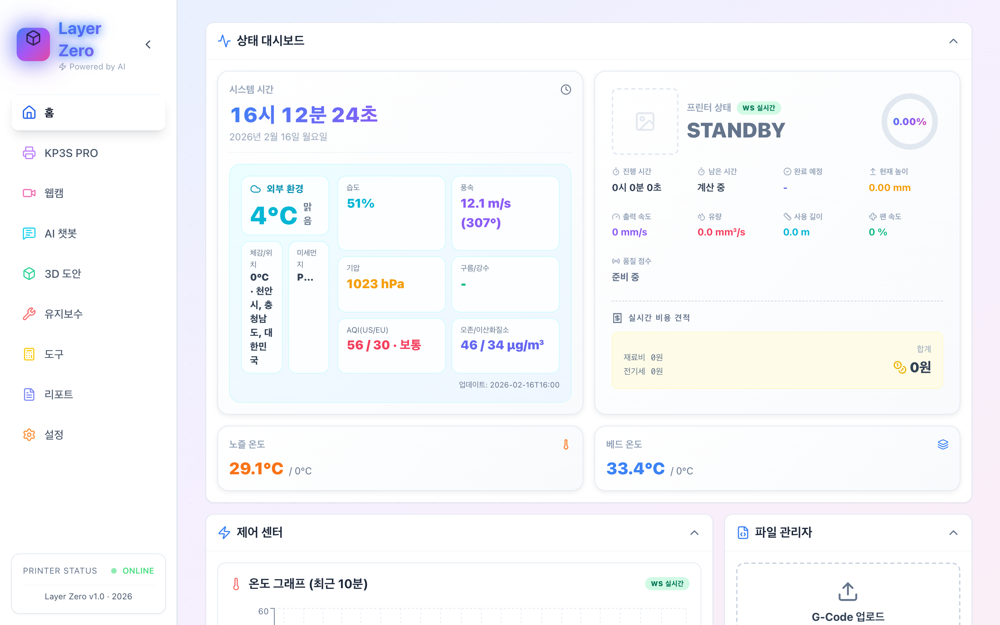
  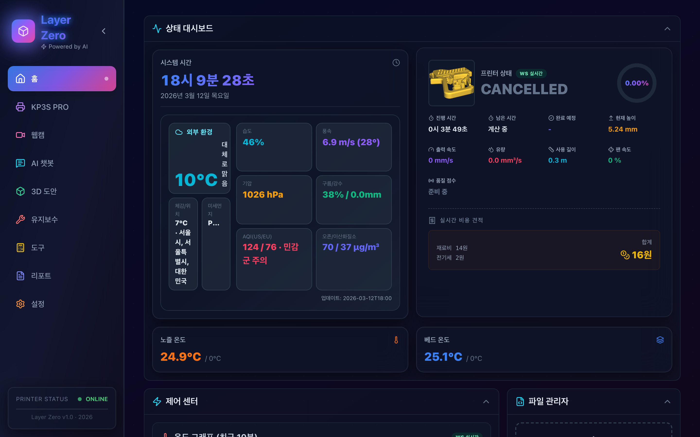
</p>

<p>
  
  
  
  
  
  
  
</p>

</div>

---

## 목차
- [프로젝트 개요](#프로젝트-개요)
- [핵심 기능](#핵심-기능)
- [화면 둘러보기](#화면-둘러보기)
- [아키텍처](#아키텍처)
- [기술 스택](#기술-스택)
- [빠른 시작](#빠른-시작)
- [환경 변수 가이드](#환경-변수-가이드)
- [상시 운영 가이드PM2](#상시-운영-가이드pm2)
- [백업복구 전략](#백업복구-전략)
- [보안 체크리스트](#보안-체크리스트)
- [트러블슈팅](#트러블슈팅)
- [문서](#문서)

---

## 프로젝트 개요
Layer Zero는 3D 프린터 운영에서 가장 시간이 많이 드는 구간을 줄이기 위해 만든 웹 콘솔입니다.

일반적으로 출력 품질 문제는 아래 이유로 반복됩니다.
- 상태 확인/제어/기록 화면이 분리되어 있어 작업 맥락이 끊김
- 출력 중 이상 징후를 실시간으로 정리해서 보기 어려움
- 운영 데이터가 기기마다 흩어져 재현이 어려움

Layer Zero는 이 흐름을 하나의 운영 루프로 통합합니다.
1. 홈에서 실시간 상태/경고/비용/환경 정보 확인
2. 필요한 제어(매크로, 콘솔, 자동 레벨링) 즉시 실행
3. 출력 완료 후 리포트/유지보수 데이터 자동 누적
4. 다중 기기에서 같은 데이터(설정/이력) 공유

---

## 핵심 기능

<table>
  <thead>
    <tr>
      <th align="left">영역</th>
      <th align="left">핵심 기능</th>
      <th align="left">운영 효과</th>
    </tr>
  </thead>
  <tbody>
    <tr>
      <td><strong>홈 대시보드</strong></td>
      <td>진행률, 남은 시간(초 단위), 온도, 속도, 유량, 팬, 비용, 경고 카드</td>
      <td>상태 판단 시간 단축, 즉시 대응</td>
    </tr>
    <tr>
      <td><strong>프린터 제어</strong></td>
      <td>온디맨드 Klipper 웹뷰 임베드, 콘솔 명령, 빠른 액션, 매크로</td>
      <td>화면 전환 최소화, 기본 메모리 점유 절감</td>
    </tr>
    <tr>
      <td><strong>자동 레벨링</strong></td>
      <td>베드 히팅 → G28 → BED_MESH_CALIBRATE → SAVE_CONFIG</td>
      <td>반복 작업 단순화, 절차 누락 방지</td>
    </tr>
    <tr>
      <td><strong>웹캠 운영</strong></td>
      <td>듀얼 ESP32-CAM, 회전/반전/보정, 스냅샷</td>
      <td>저해상도 환경에서 모니터링 품질 개선</td>
    </tr>
    <tr>
      <td><strong>AI 챗봇</strong></td>
      <td>Free/Paid 모드, Flash/Flash Lite/Pro 3.1 선택, 대화 유지/요약/재생성</td>
      <td>현장 트러블슈팅 속도 향상</td>
    </tr>
    <tr>
      <td><strong>유지보수</strong></td>
      <td>소모품 추적, 체크리스트, 로그, 베드 메쉬 히트맵 + 선택형 3D 그래프</td>
      <td>예방 정비 체계화, 다중 3D 차트 과부하 감소</td>
    </tr>
    <tr>
      <td><strong>리포트</strong></td>
      <td>출력 완료 리포트 자동 저장, 품질/비용 상세 분석</td>
      <td>재현 가능한 개선 루프 형성</td>
    </tr>
    <tr>
      <td><strong>중앙 동기화</strong></td>
      <td>Node 저장소 + SSE 실시간 동기화 + 로컬 폴백 + 선택형 토큰 보호</td>
      <td>다중 기기 운영 일관성 확보</td>
    </tr>
  </tbody>
</table>

---

## 화면 둘러보기

### 1) 홈 / 프린터 / 웹캠
#### Light
<table>
  <thead>
    <tr>
      <th>홈</th>
      <th>프린터</th>
      <th>웹캠</th>
    </tr>
  </thead>
  <tbody>
    <tr>
      <td><a href="photo/docs/home-light.png"></a></td>
      <td><a href="photo/docs/printer-light.png">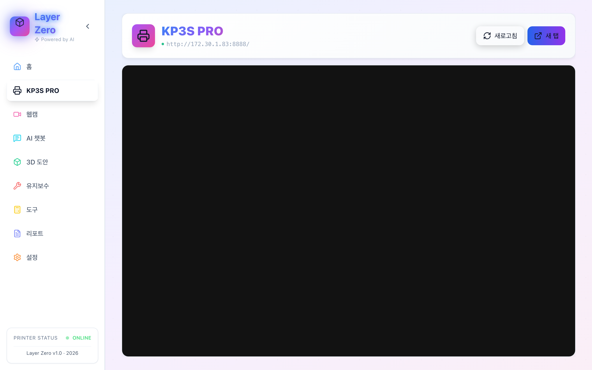</a></td>
      <td><a href="photo/docs/webcam-light.png">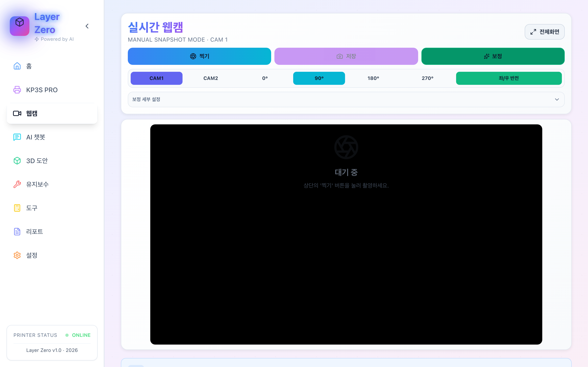</a></td>
    </tr>
  </tbody>
</table>

#### Dark
<table>
  <thead>
    <tr>
      <th>홈</th>
      <th>프린터</th>
      <th>웹캠</th>
    </tr>
  </thead>
  <tbody>
    <tr>
      <td><a href="photo/docs/home-dark.png"></a></td>
      <td><a href="photo/docs/printer-dark.png">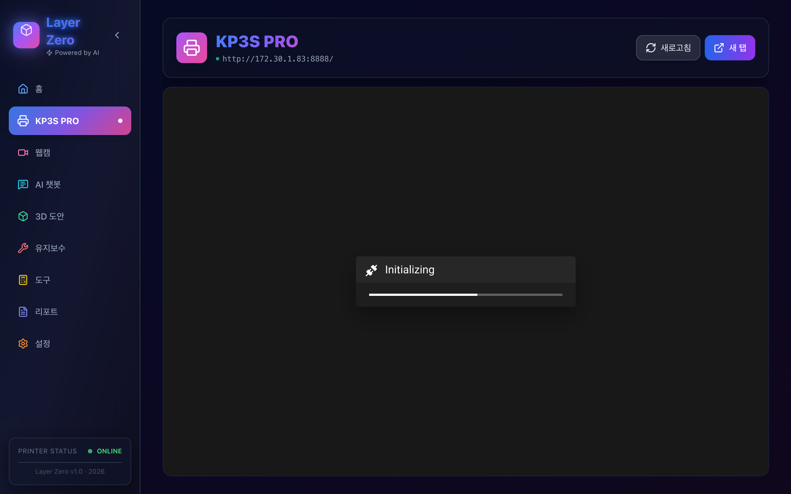</a></td>
      <td><a href="photo/docs/webcam-dark.png">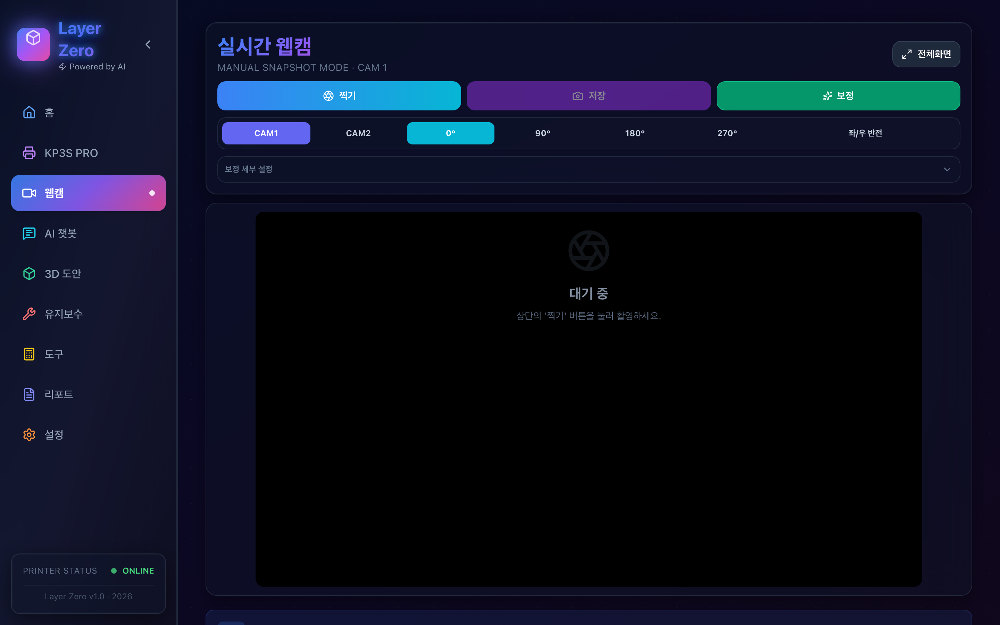</a></td>
    </tr>
  </tbody>
</table>

### 2) AI 챗봇 / 유지보수 / 리포트
#### Light
<table>
  <thead>
    <tr>
      <th>AI 챗봇</th>
      <th>유지보수</th>
      <th>리포트</th>
    </tr>
  </thead>
  <tbody>
    <tr>
      <td><a href="photo/docs/chatbot-light.png">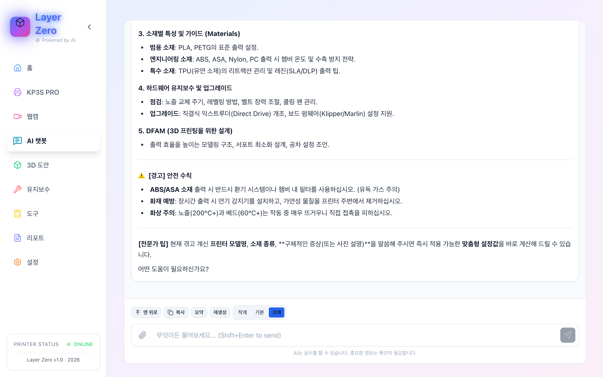</a></td>
      <td><a href="photo/docs/maintenance-light.png">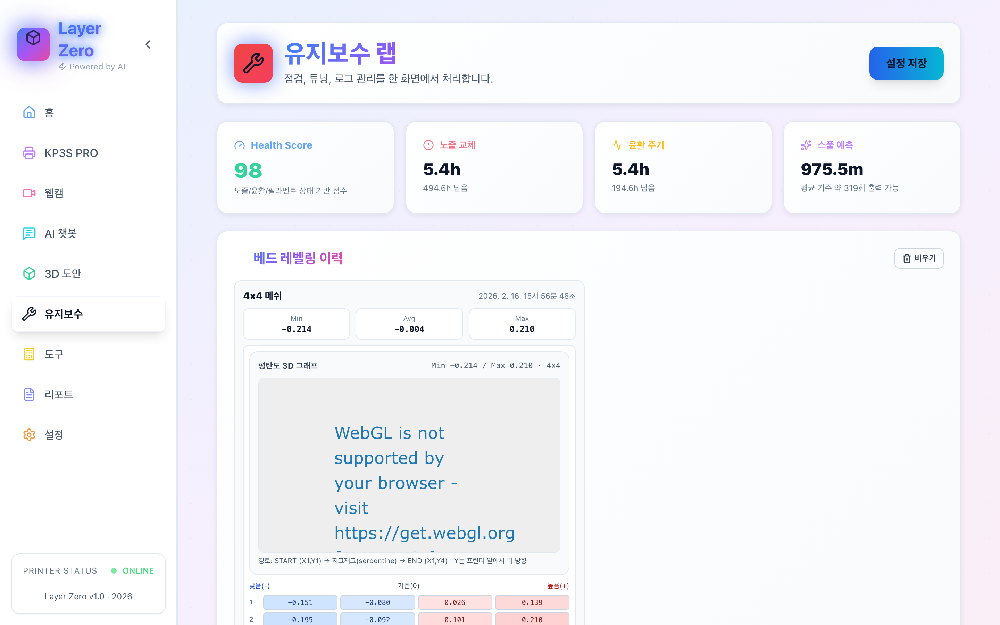</a></td>
      <td><a href="photo/docs/reports-light.png">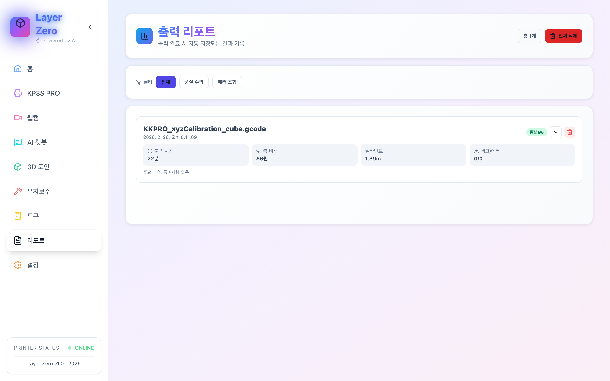</a></td>
    </tr>
  </tbody>
</table>

#### Dark
<table>
  <thead>
    <tr>
      <th>AI 챗봇</th>
      <th>유지보수</th>
      <th>리포트</th>
    </tr>
  </thead>
  <tbody>
    <tr>
      <td><a href="photo/docs/chatbot-dark.png">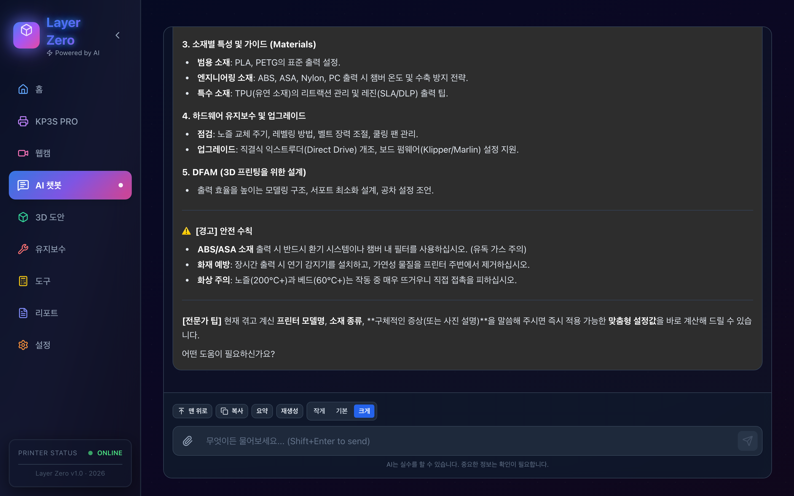</a></td>
      <td><a href="photo/docs/maintenance-dark.png">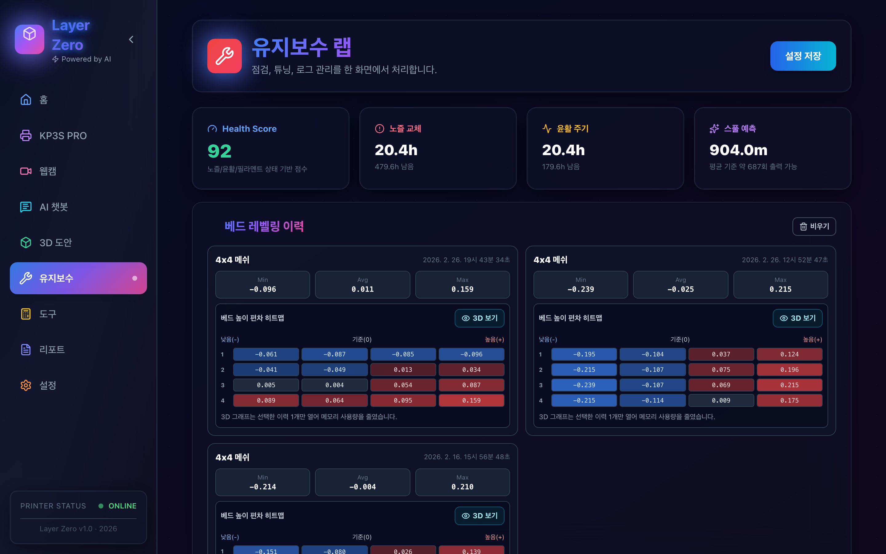</a></td>
      <td><a href="photo/docs/reports-dark.png">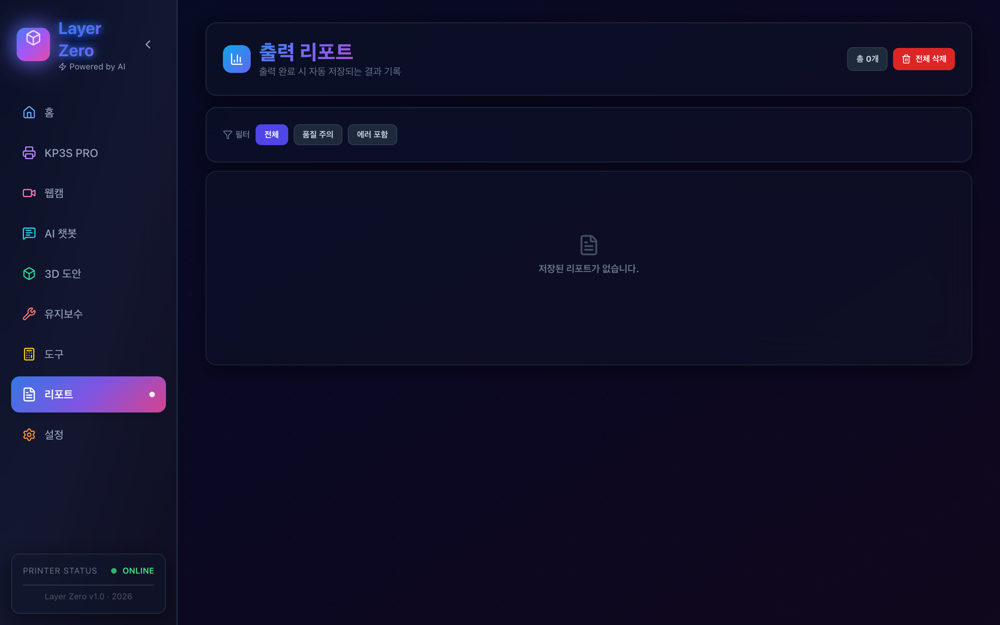</a></td>
    </tr>
  </tbody>
</table>

### 3) 3D 도안 / 도구 / 설정
#### Light
<table>
  <thead>
    <tr>
      <th>3D 도안</th>
      <th>도구</th>
      <th>설정</th>
    </tr>
  </thead>
  <tbody>
    <tr>
      <td><a href="photo/docs/models-models-light.png">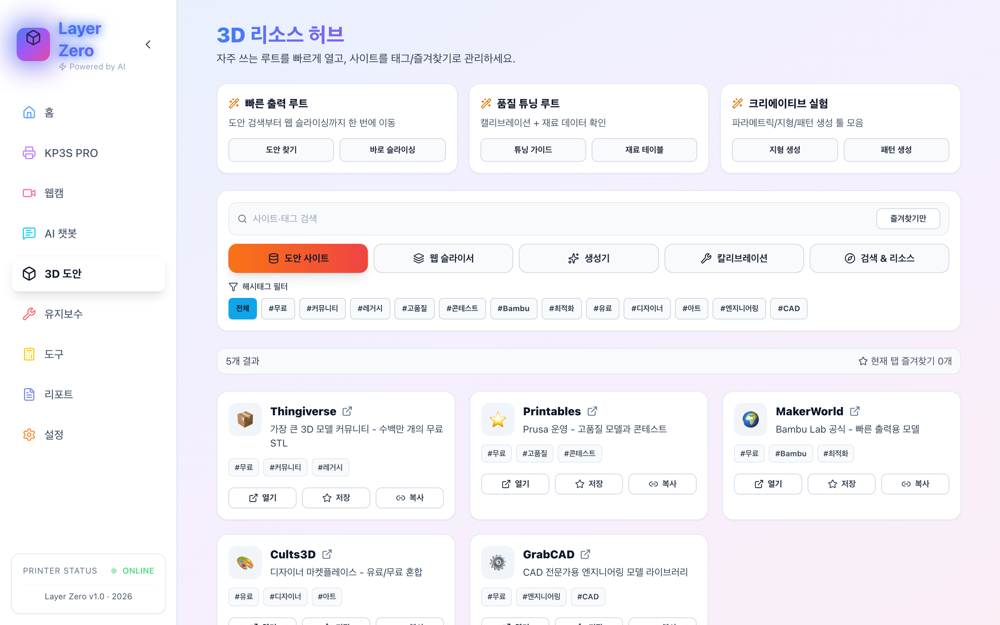</a></td>
      <td><a href="photo/docs/tools-light.png">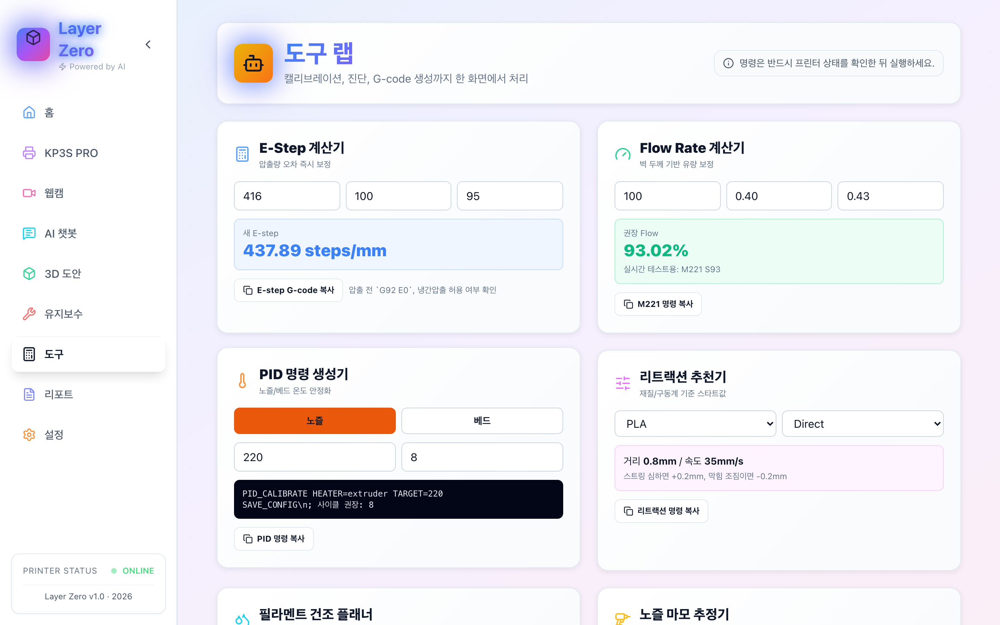</a></td>
      <td><a href="photo/docs/settings-light.png">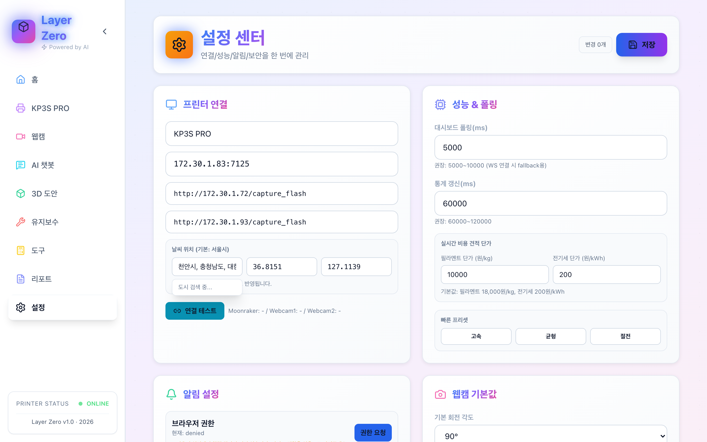</a></td>
    </tr>
  </tbody>
</table>

#### Dark
<table>
  <thead>
    <tr>
      <th>3D 도안</th>
      <th>도구</th>
      <th>설정</th>
    </tr>
  </thead>
  <tbody>
    <tr>
      <td><a href="photo/docs/models-models-dark.png">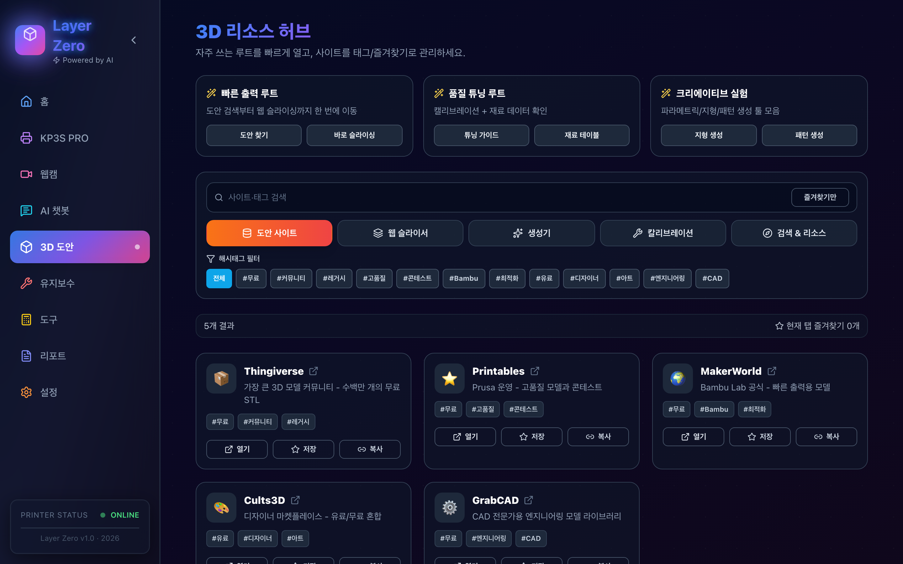</a></td>
      <td><a href="photo/docs/tools-dark.png">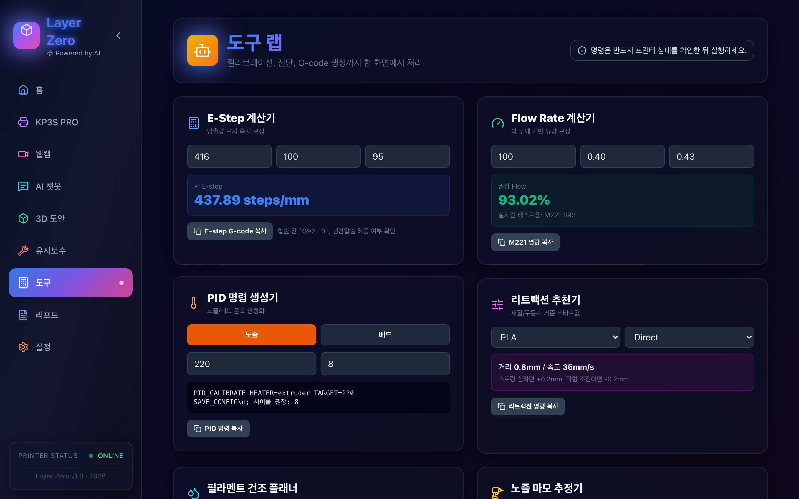</a></td>
      <td><a href="photo/docs/settings-dark.png">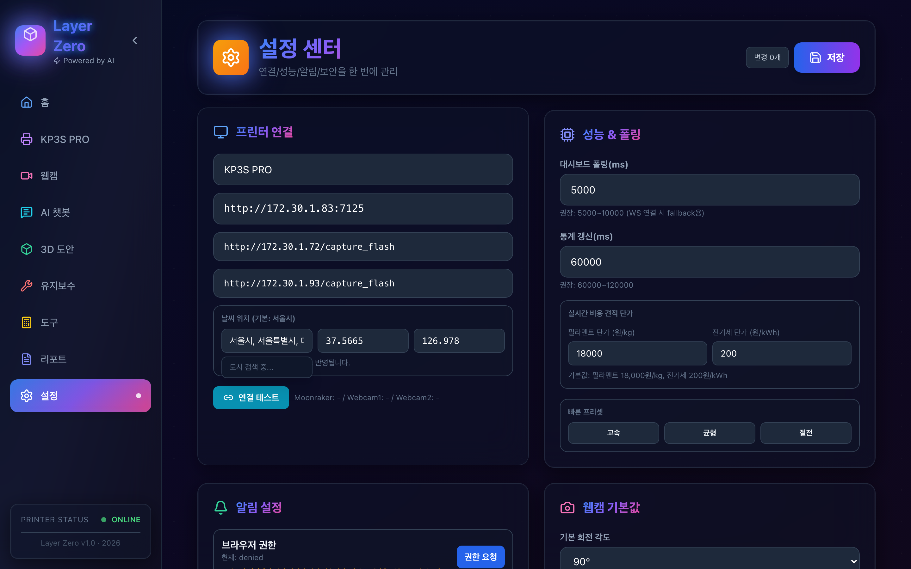</a></td>
    </tr>
  </tbody>
</table>

---

## 아키텍처

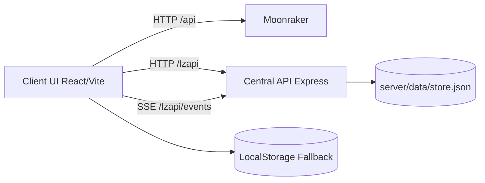
```mermaid
flowchart LR
  A[Client UI React/Vite] -->|HTTP /api| B[Moonraker]
  A -->|HTTP /lzapi| C[Central API Express]
  A -->|SSE /lzapi/events| C
  C --> D[(server/data/store.json)]
  A --> E[(LocalStorage Fallback)]
```

### 데이터 흐름 요약
- 프린터 실시간 데이터: UI → Moonraker(`/api` 프록시)
- 설정/이력/리포트/챗 기록: UI ↔ Central API(`/lzapi`)
- 실시간 동기화: SSE 이벤트 기반 변경 전파
- 장애 대비: 중앙 API 불가 시 LocalStorage 임시 폴백

---

## 기술 스택

### 프론트엔드
- React 19
- Vite 7
- Tailwind CSS
- Recharts / Plotly (차트)
- Lucide 아이콘

### 백엔드(경량 중앙 저장소)
- Node.js + Express
- JSON File Store (`server/data/store.json`)
- SSE(Server-Sent Events)

### 운영
- PM2
- Vite Proxy (`/api`, `/lzapi`)

---

## 빠른 시작

### 1) 요구 사항
- Node.js 20.19 이상
- npm
- Moonraker가 설치된 Klipper 장비

### 2) 설치
```bash
git clone https://github.com/habinsong/Layer-Zero.git
cd Layer-Zero
npm install
```

### 3) 환경 파일 생성
```bash
cp .env.example .env.local
```

### 4) 실행
```bash
npm run dev
```

접속 주소:
- Web UI: `http://localhost:5173`
- Central API Health: `http://localhost:8787/lzapi/health`

---

## 환경 변수 가이드

> 실제 배포/공개 저장소에서는 API 키를 비워두고, 각 사용자 환경에서만 입력하세요.
> AI API 키는 서버에 저장하지 않으며, 각 브라우저의 로컬 설정에서만 유지됩니다.
> 지원 모델: Free는 `gemini-3-flash-preview`, `gemini-3.1-flash-lite-preview`, Paid는 여기에 `gemini-3.1-pro-preview`가 추가됩니다.

| 변수 | 예시 | 설명 |
|---|---|---|
| `VITE_DEFAULT_PRINTER_NAME` | `KP3S PRO` | UI 기본 프린터 이름 |
| `VITE_DEFAULT_KLIPPER_IP` | `172.30.1.83:8888` | 기본 장비 주소. `:8888` 입력 시 내부적으로 Moonraker `:7125`로 보정 |
| `VITE_DEFAULT_WEBCAM_URL` | `http://172.30.1.72/capture_flash` | 웹캠 1 URL |
| `VITE_DEFAULT_WEBCAM_URL2` | `http://172.30.1.93/capture_flash` | 웹캠 2 URL |
| `VITE_DEFAULT_WEATHER_CITY` | `서울시` | 기본 도시명 |
| `VITE_DEFAULT_WEATHER_LAT` | `37.5665` | 기본 위도 |
| `VITE_DEFAULT_WEATHER_LON` | `126.9780` | 기본 경도 |
| `VITE_MOONRAKER_FALLBACK_IP` | `172.30.1.83` | Moonraker 폴백 IP |
| `VITE_DEV_PROXY_TARGET` | `http://172.30.1.83:7125` | 개발 중 `/api` 프록시 대상 |
| `VITE_APP_API_BASE` | `/lzapi` | 중앙 API base path |
| `VITE_APP_API_TARGET` | `http://127.0.0.1:8787` | 개발 중 `/lzapi` 프록시 대상 |
| `VITE_APP_API_TOKEN` | `(빈값)` | 중앙 API 보호 토큰. `LZ_API_TOKEN`과 동일하게 맞춰 사용 |
| `VITE_DEV_HOST` | `127.0.0.1` | 개발 서버 바인딩 호스트. 외부 접속이 필요할 때만 변경 |
| `LZ_API_HOST` | `127.0.0.1` | 중앙 API 바인딩 호스트. 기본은 로컬 전용 |
| `LZ_API_TOKEN` | `(빈값)` | 중앙 API 인증 토큰. 외부 바인딩 시 설정 권장 |
| `LZ_ALLOWED_ORIGINS` | `http://192.168.0.10:5173` | 추가 허용 Origin 목록(쉼표 구분) |

---

## 상시 운영 가이드(PM2)

### 방법 A: 프로젝트 스크립트
```bash
chmod +x start-server.sh
./start-server.sh
```

### 방법 B: PM2 수동 운영
```bash
pm2 start ecosystem.config.cjs
pm2 list
pm2 logs web-print
pm2 restart web-print
pm2 stop web-print
pm2 delete web-print
```

### 재부팅 후 자동 시작
```bash
pm2 save
pm2 startup
```

> `pm2 startup` 실행 시 출력되는 명령을 반드시 한 번 더 실행해야 자동 시작이 완성됩니다.

---

## 백업/복구 전략

### 백업 대상
- `server/data/store.json`
- `.env.local` (운영 환경 전용)

### 권장 주기
- 최소 일 1회 자동 백업
- 출력 작업이 많은 환경: 6시간 주기

### 복구 절차
1. 서버 중지
2. 백업본 `store.json` 복원
3. 서버 재시작
4. 클라이언트 새로고침 후 데이터 확인

---

## 보안 체크리스트
- `.env.local` 절대 커밋 금지
- 공개 저장소 업로드 전 API 키 제거
- 중앙 API 기본 바인딩은 `127.0.0.1`이며, 외부 공개가 필요할 때만 `LZ_API_HOST`를 변경
- 외부 바인딩 시 `LZ_API_TOKEN`과 `LZ_ALLOWED_ORIGINS`를 함께 설정
- 내부망 외부 공개 시 HTTPS + 인증 + 방화벽 적용
- `server/data/store.json` 접근권한 최소화
- 공유 장비에서는 설정 초기화/키 교체 절차 운영

---

## 트러블슈팅

### 1) 홈에서 OFFLINE 표시
- Moonraker 포트가 실제로 `7125`인지 확인
- 설정 탭의 Klipper 주소와 장비 주소 일치 여부 확인
- Moonraker의 `cors_domains`, `trusted_clients` 확인
- 브라우저 Network에서 `/api/server/info` 응답 코드 확인

### 2) 파일 목록은 보이는데 업로드 실패
- Moonraker `max_upload_size` 확인
- file_manager 권한/경로 확인
- 스토리지 가용량 확인

### 3) iOS Safari 복귀 후 데이터 멈춤
- 네트워크 전환 후 재연결 지연 가능
- 수 초 대기 후 미복구 시 새로고침
- 동일 증상 반복 시 SSE 연결 상태 확인

### 4) 브라우저 알림 미동작
- HTTPS 또는 localhost 정책 여부 확인
- 브라우저 알림 권한 허용 여부 확인
- iOS PWA 제한사항(브라우저별 정책) 확인

### 5) 프린터 페이지에 웹뷰가 바로 안 보임
- 현재 기본 동작은 경량 모드이며, `이 페이지 안에서 열기`를 눌러야 iframe이 마운트됨
- 장시간 모니터링은 `새 탭` 사용이 메모리 측면에서 더 유리할 수 있음

### 6) 유지보수에서 3D 그래프가 목록에 안 보임
- 베드 메쉬 이력 카드는 기본적으로 히트맵만 표시
- 각 이력의 `3D 보기` 버튼을 눌렀을 때만 Plotly 3D 그래프가 열림

---

## 품질 체크 명령
```bash
npm run lint
npm run build
```

---

## 문서
- 상세 기능/운영 가이드: [LAYER_ZERO_PROJECT_GUIDE.md](LAYER_ZERO_PROJECT_GUIDE.md)

---

## 라이선스
이 프로젝트는 **GNU General Public License v3.0 (GPL-3.0)** 하에 배포됩니다.

- 라이선스 전문: [LICENSE](LICENSE)
- SPDX 식별자: `GPL-3.0`
