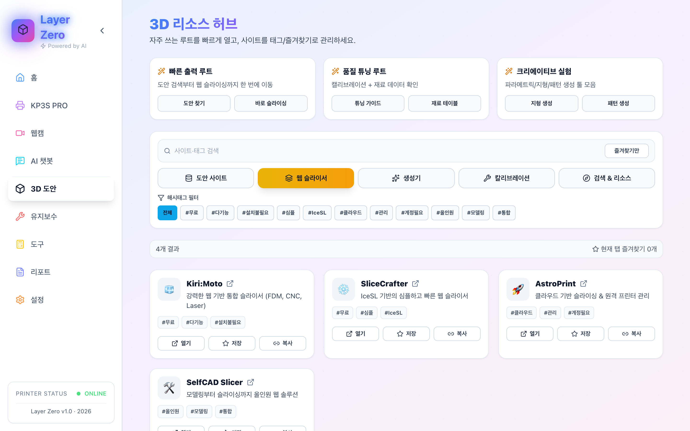

# Layer Zero


Klipper + Moonraker 기반 3D 프린터를 위한 올인원 웹 콘솔입니다.

## 핵심 요약

- **실시간 대시보드**: 상태, 진행률, 온도, 속도, 비용 등 핵심 정보 한눈에 파악
- **강력한 제어**: Klipper 원본 인터페이스 내장, 매크로 실행, 비상 정지
- **멀티 웹캠**: 듀얼 카메라 지원 및 실시간 이미지 보정 (회전/필터)
- **AI 어시스턴트**: 3D 프린팅 전문 챗봇 (Free/Paid 모델)
- **통합 워크플로우**: 도안 검색 -> 웹 슬라이싱 -> 출력 -> 리포트 자동화
- **유지보수 관리**: 소모품 수명 추적 및 정비 이력/체크리스트
- **데이터 시각화**: 베드 메쉬 3D 그래프, 비용/품질 타임라인

---

## 주요 기능 및 스크린샷

### 1. 홈 (Home)
프린팅 상태를 실시간으로 모니터링하고 핵심 기능을 제어합니다.


### 2. 프린터 (Printer)
Klipper(Fluid/Mainsail) 인터페이스를 통해 G-code 및 설정을 정밀 제어합니다.


### 3. 웹캠 (Webcam)
출력 상황을 실시간으로 확인하고 화면을 보정합니다.


### 4. AI 챗봇 (AI Chatbot)
인공지능을 활용해 문제 해결을 지원받습니다.


### 5. 3D 도안 (3D Models)
도안 검색, 슬라이서, 각종 생성 도구를 한곳에서 이용합니다.



### 6. 유지보수 (Maintenance)
프린터의 건강 상태와 정비 이력을 관리합니다.


### 7. 도구 (Tools)
캘리브레이션 및 트러블슈팅을 위한 유틸리티 모음입니다.


### 8. 리포트 (Reports)
완료된 출력물의 품질과 비용을 분석합니다.


### 9. 설정 (Settings)
시스템 연결 및 환경 설정을 관리합니다.


---

## 설치 및 실행

### 요구 사항
- Node.js 18+
- Moonraker가 설치된 3D 프린터 (Klipper)

### 설치
```bash
npm install
```

### 실행
```bash
# 환경 설정 복사
cp .env.example .env.local

# 개발 서버 실행 (Web + API)
npm run dev
```
- 웹: `http://localhost:5173`
- API: `http://localhost:8787`

---

## 문서
- [상세 프로젝트 가이드](LAYER_ZERO_PROJECT_GUIDE.md)
